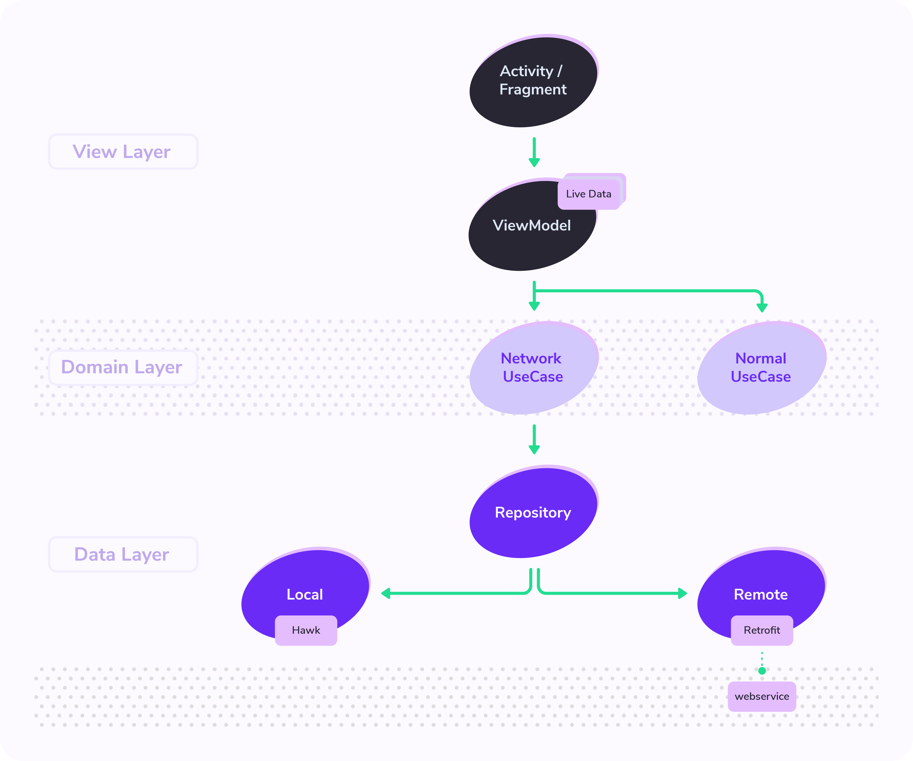
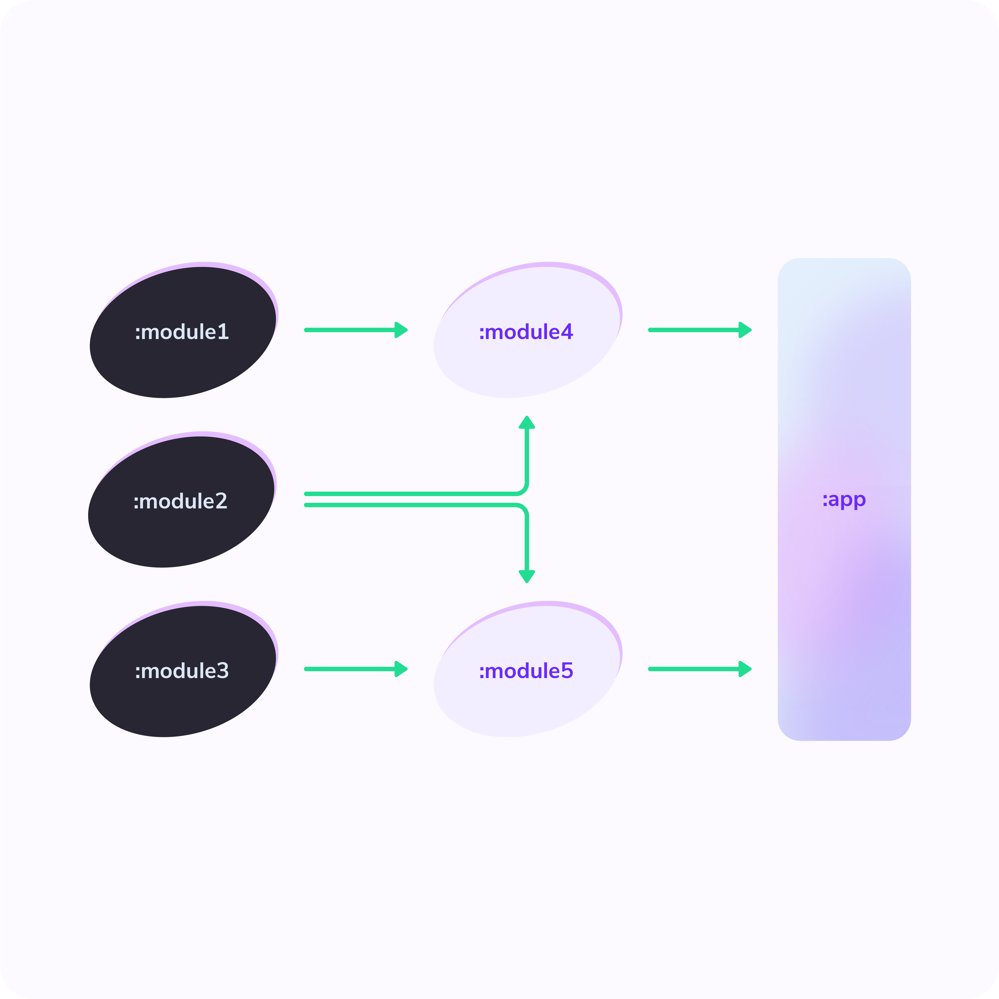
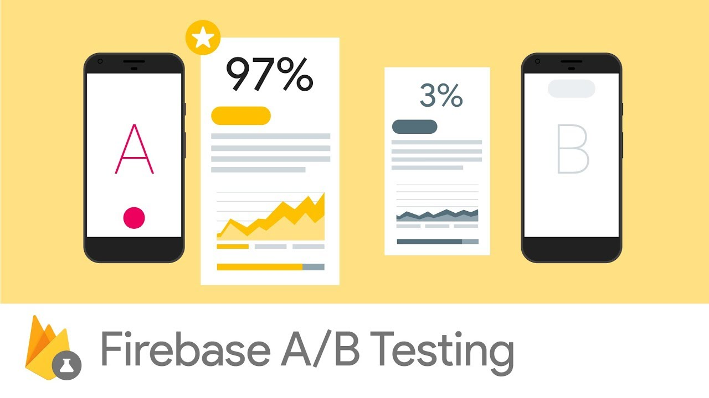

## Programming languages
### Kotlin

### Why is Android development Kotlin-first?

We reviewed feedback that came directly from developers at conferences, our Customer Advisory Board (CAB), Google Developers Experts (GDE), and through our developer research. Many developers already enjoy using Kotlin, and the request for more Kotlin support was clear. Here’s what developers appreciate about writing in Kotlin:

-   **Expressive and concise:** You can do more with less. Express your ideas and reduce the amount of boilerplate code. 67% of professional developers who use Kotlin say Kotlin has increased their productivity.
-   **Safer code:** Kotlin has many language features to help you avoid common programming mistakes such as null pointer exceptions. Android apps that contain Kotlin code are 20% less likely to crash.
-   **Interoperable:** Call Java-based code from Kotlin, or call Kotlin from Java-based code. Kotlin is 100% interoperable with the Java programming language, so you can have as little or as much of Kotlin in your project as you want.
-   **Structured Concurrency:** Kotlin coroutines make asynchronous code as easy to work with as blocking code. Coroutines dramatically simplify background task management for everything from network calls to accessing local data.
- ---
## Development environment
### Android Studio

Android Studio is the official Integrated Development Environment (IDE) for Android app development, based on IntelliJ IDEA . On top of IntelliJ's powerful code editor and developer tools, Android Studio offers even more features that enhance your productivity when building Android apps, such as:

-   A flexible Gradle-based build system
-   A fast and feature-rich emulator
-   A unified environment where you can develop for all Android devices
-   Apply Changes to push code and resource changes to your running app without restarting your app
-   Code templates and GitHub integration to help you build common app features and import sample code
-   Extensive testing tools and frameworks
-   Lint tools to catch performance, usability, version compatibility, and other problems
-   C++ and NDK support
-   Built-in support for Google Cloud Platform, making it easy to integrate Google Cloud Messaging and App Engine
- ---
## App architecture
### Android Architecture component

#### View Layer

The role of the View layer (or _presentation layer_) is to display the application data on the screen. Whenever the data changes, either due to user interaction (such as pressing a button) or external input (such as a network response), the UI should update to reflect the changes.

The View layer is made up of two things:

-   UI elements that render the data on the screen. You build these elements using Views or Jetpack Compose functions.
-   State holders (such as ViewModel classes) that hold data, expose it to the UI, and handle logic.

#### Domain layer

The domain layer is an optional layer that sits between the UI and data layers.

The domain layer is responsible for encapsulating complex business logic, or simple business logic that is reused by multiple ViewModels. This layer is optional because not all apps will have these requirements. You should use it only when needed—for example, to handle complexity or favor reusability.

#### Data layer

The data layer of an app contains the _business logic_. The business logic is what gives value to your app—it's made of rules that determine how your app creates, stores, and changes data.

The data layer is made of _repositories_ that each can contain zero to many _data sources_. You should create a repository class for each different type of data you handle in your app. For example, you might create a `MoviesRepository` class for data related to movies, or a `PaymentsRepository` class for data related to payments.

### Modular Architecture

In Google I/0 19, they talked about how to create a modular Android Application architecture. They emphasize the fact that developers should be segregated to specialise in different aspects when developing the application in order to provide a clean and organised application.

#### Faster CI

It is possible to run your continuous integration service faster by having small modules which have bigger modules depending on them. For example, if you need to test module 5; you would only need to run the modules that depend on it. As the other modules are not impacted, there would be no point running any other module.

####  Good for Business

From the Play Store statistics, it has been determined that the number of users drops between the moment they install the app and the moment they can start using the app. To prevent this; you can modularize your application with app bundle in order to reduce the installation size.

####  Module

The Android App Bundle packaging concept involves the greater library modules as well as the dynamic feature modules. For example, we can have a base app which is dependent on module 1, also known to be the android library. This means the app can reach the code and resources from module 1. Furthermore, we can have other modules i.e. module 2 and module 3 which can be the dynamic feature modules. These can be used for on-demand code loading via dynamic delivery.

#### Working with Dynamic Feature Modules

Working with dynamic feature modules brings a few challenges even if you use on-demand delivery. One of these challenges is with navigation. For example, we have the MainActivity and want to navigate to the AboutActivity.

### Android Jetpack

Jetpack is a suite of libraries to help developers follow best practices, reduce boilerplate code, and write code that works consistently across Android versions and devices so that developers can focus on the code they care about.

**View Binding**

View binding is a feature that allows you to more easily write code that interacts with views. Once view binding is enabled in a module, it generates a _binding class_ for each XML layout file present in that module. An instance of a binding class contains direct references to all views that have an ID in the corresponding layout.

In most cases, view binding replaces `findViewById`.

****Security****

The library uses the builder pattern to provide safe default settings for the following security levels: Strong security that balances great encryption and good performance. This level of security is appropriate for consumer apps, such as banking and chat apps, as well as enterprise apps that perform certificate revocation checking. Maximum security. This level of security is appropriate for apps that require a hardware-backed keystore and user presence for providing key access. This guide shows how to work with the Security library's recommended security configurations, as well as how to read and write encrypted data that's stored in files and shared preferences easily and safely.

### Jetpack Compose

Jetpack Compose is Android’s modern toolkit for building native UI. It simplifies and accelerates UI development on Android bringing your apps to life with less code, powerful tools, and intuitive Kotlin APIs. It makes building Android UI faster and easier. While creating Compose we worked with different partners who experienced all of these benefits first hand and shared some of their takeaways with us.

#### Less code

Writing less code affects all stages of development: as an author, you get to focus on the problem at hand, with less to test and debug and with less chances of bugs; as a reviewer or maintainer you have less code to read, understand, review and maintain.

#### Intuitive

Just describe your UI, and Compose takes care of the rest. As app state changes, your UI automatically updates.

#### Accelerate development

Compose is compatible with all your existing code so you can call Compose code from Views and Views from Compose. Most common libraries like Navigation, ViewModel and Kotlin coroutines work with Compose, so you can start adopting when and where you want.

#### Powerful

Compose enables you to create beautiful apps with direct access to the Android platform APIs and built-in support for Material Design, Dark theme, animations, and more.

### Kotlin coroutines on Android

A _coroutine_ is a concurrency design pattern that you can use on Android to simplify code that executes asynchronously. [Coroutines](https://kotlinlang.org/docs/reference/coroutines/coroutines-guide.html) were added to Kotlin in version 1.3 and are based on established concepts from other languages.

On Android, coroutines help to manage long-running tasks that might otherwise block the main thread and cause your app to become unresponsive. Over 50% of professional developers who use coroutines have reported seeing increased productivity. This topic describes how you can use Kotlin coroutines to address these problems, enabling you to write cleaner and more concise app code.

#### Features

Coroutines is our recommended solution for asynchronous programming on Android. Noteworthy features include the following:

-   **Lightweight**: You can run many coroutines on a single thread due to support for _[suspension](https://kotlinlang.org/docs/reference/coroutines/basics.html)_, which doesn't block the thread where the coroutine is running. Suspending saves memory over blocking while supporting many concurrent operations.
-   **Fewer memory leaks**: Use _structured concurrency_ to run operations within a scope.
-   **Built-in cancellation support**: Cancellation is propagated automatically through the running coroutine hierarchy.
-   **Jetpack integration**: Many Jetpack libraries include extensions that provide full coroutines support. Some libraries also provide their own coroutine scope that you can use for structured concurrency.
- --

## Dependency injection in Android
### Koin

A pragmatic and lightweight dependency injection framework for Kotlin developers.

---

## Engage products
### Firebase Analytics

Google Analytics helps you understand how people use your web, Apple, or Android app. The SDK automatically captures a number of events and user properties and also allows you to define your own custom events to measure the things that uniquely matter to your business. Once the data is captured, it's available in a dashboard through the Firebase console. This dashboard provides detailed insights about your data — from summary data such as active users and demographics, to more detailed data such as identifying your most purchased items.

### Optimize app experience with Firebase A/B Testing and Firebase Remote Config

Firebase A/B Testing helps you optimize your app experience by making it easy to run, analyze, and scale product and marketing experiments. It gives you the power to test changes to your app’s UI, features, or engagement campaigns to see if they actually move the needle on your key metrics (like revenue and retention) before you roll them out widely. A/B Testing works with FCM so you can test different marketing messages, and with Remote Config so you can test changes within your app.

## Release & Monitor Application
### Firebase Crashlytics

Firebase Crashlytics is a lightweight, realtime crash reporter that helps you track, prioritize, and fix stability issues that erode your app quality. Crashlytics saves you troubleshooting time by intelligently grouping crashes and highlighting the circumstances that lead up to them. Find out if a particular crash is impacting a lot of users. Get alerts when an issue suddenly increases in severity. Figure out which lines of code are causing crashes.

### Firebase Performance Monitoring

Firebase Performance Monitoring is a service that helps you to gain insight into the performance characteristics of your Apple, Android, and web apps. You use the Performance Monitoring SDK to collect performance data from your app, then review and analyze that data in the Firebase console. Performance Monitoring helps you to understand in real time where the performance of your app can be improved so that you can use that information to fix performance issues.

### Firebase Test Lab

Firebase Test Lab lets you test your app on a range of devices and configurations. This Get Started guide provides an implementation path for you to follow, as well as an introduction to Test Lab's Android offerings.

### Firebase App Distribution

Firebase App Distribution makes distributing your apps to trusted testers painless. By getting your apps onto testers' devices quickly, you can get feedback early and often. And if you use Crashlytics in your apps, you’ll automatically get stability metrics for all your builds, so you know when you’re ready to ship.

### Ktlint format
Spending time on configuration (& maintenance down the road) of hundred-line long style config file(s) is counter-productive. Instead of wasting your energy on something that has no business value - focus on what really matters (not debating whether to use tabs or spaces).

By using ktlint you put the importance of code clarity and community conventions over personal preferences. This makes things easier for people reading your code as well as frees you from having to document & explain what style potential contributor(s) have to follow.

ktlint is a single binary with both linter & formatter included. All you need is to drop it in (no need to get [overwhelmed](https://en.wikipedia.org/wiki/decision_fatigue) while choosing among [dozens of code style options](http://checkstyle.sourceforge.net/checks.html)).

### Code Coverage

JaCoCo should provide the standard technology for code coverage analysis in Java VM based environments. The focus is on providing a lightweight, flexible and well-documented library for integration with various build and development tools.

### Test apps on Android

Testing your app is an integral part of the app development process. By running tests against your app consistently, you can verify your app's correctness, functional behavior, and usability before you release it publicly.

Testing also offers the following advantages:

-   **Rapid feedback** on failures.
-   **Early failure detection** in the development cycle.
-   **Safer code refactoring**, allowing you to optimize code without worrying about regressions.
-   **Stable development velocity**, helping you minimize technical debt.

A local test runs directly on your own workstation, rather than an Android device or emulator. As such, it uses your local Java Virtual Machine (JVM), rather than an Android device to run tests. Local tests enable you to evaluate your app's logic more quickly. However, not being able to interact with the Android framework creates a limitation in the types of tests you can run.

A _unit_ test verifies the behavior of a small section of code, the _unit under test_. It does so by executing that code and checking the result.

Unit tests are usually simple but their setup can be problematic when the _unit under test_ is not designed with testability in mind:

-   The code that you want to verify needs to be _accessible_ from a test. For example, you can't test a private method directly. Instead, you test the class using its public APIs.
-   In order to run unit tests in _isolation_, the dependencies of the unit under tests must be replaced by components that you control, such as fakes or other [test doubles](https://developer.android.com/training/testing/fundamentals/test-doubles). This is especially problematic if your code depends on the Android framework.

Testing user interactions helps ensure users do not encounter unexpected results or have a poor experience when interacting with your app. You should get into the habit of creating user interface (UI) tests if you need to verify that the UI of your app is functioning correctly.

One approach to UI testing is to simply have a human tester perform a set of user operations on the target app and verify that it is behaving correctly. However, this manual approach can be time-consuming and error-prone. A more efficient approach is to write your UI tests such that user actions are performed in an automated way. The automated approach allows you to run your tests quickly and reliably in a repeatable manner.

UI tests launch an app (or part of it), then simulate user interactions, and finally check that the app reacted appropriately. They are integration tests that can range from verifying the behavior of a small component to a large navigation test that traverses a whole user flow. They are useful to check for regressions and to verify compatibility with different API levels and physical devices.
