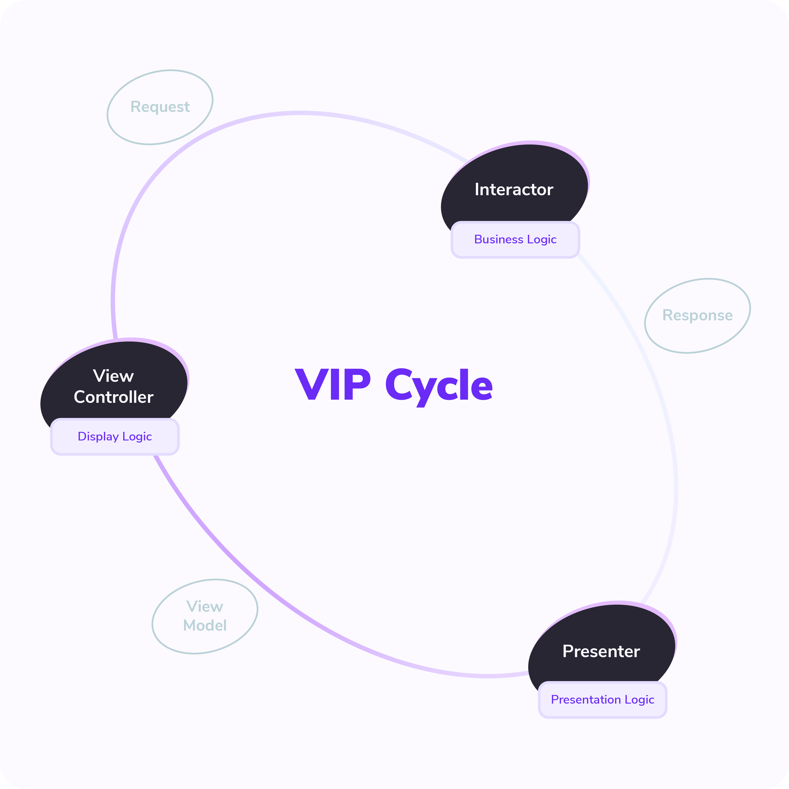

# 🍄 iOS

## Architecture

### Application main architecture (Clean Swift)


The Clean Swift architecture is derived from the Clean Architecture proposed by Uncle Bob. They share many common concepts such as the components, boundaries, and models.

### The VIP Cycle

The view controller, interactor, and presenter are the three main components of Clean Swift. They act as input and output to one another as shown in the following diagram.



### Card component architecture (MVVM)


## Dependency management

* Cartage
* Cocoapods
* Swift Package Manager


## Security

Jailbreak detection

* iOSSecuritySuite

SSL pinning

* public key pinning

#### **Data security**

* \[LV.1] General data (user default)
* \[LV.2] Credential (keychain)
* \[LV.3] Super credential (keychain + secure enclave)


## Web3

* trustwallet/**wallet-core**
* argentlabs/web3.swift


## Code Quality

* Formatter > SwiftFormat
* Lint > SwiftLinter
* Unit Test > CodeCov

.png>)


* UI Test&#x20;
  * xCode UI Test&#x20;
  * Cucumber
  * Firebase Testlab


```swift
Feature: Display User Portfolio
  Background: Application is running
  Scenario: Check Portfolio Page with Existing Properties
    Given I am on "Portfolio" page
    Then I should see "Total Value"
    Then I should see "Receive" button is enabled
    Then I should see "Send" button is enabled
    Then I should see "Wallet" tab is focused
    Then I should see "Asset List" in descening order by amount
    Then I should see "Import Token" is enabled

  Scenario: Check Wallet Expanding
    Given I am on "Portfolio" page
    When I click "BUSD" asset
    Then I should see "Receive" button on asset item is enabled
    Then I should see "Send" button on asset item is enabled

  Scenario: Check If No Wallet Imported
    Given I don't have anny wallet import
    When I am on "Portfolio" page
    Then I should not see "Receive" button is visibled
    Then I should not see "Send" button is visibled

```


## CI / CD

### CI: Github Actions + self host runner

> GitHub Actions is a **continuous integration and continuous delivery** (CI/CD) platform that allows you to automate your build, test, and deployment pipeline. You can create workflows that build and test every pull request to your repository, or deploy merged pull requests to production.

### **CD:** Fastlane&#x20;

> Automate your development and release process fastlane is an open source platform aimed at simplifying Android and iOS deployment. fastlane lets you automate every aspect of your development and release workflow.

### Build Pipeline

* Pull request
* Push develop
* Push main


### Pipeline State


### Pipeline 1: On push request (PR)


### Pipeline 2: On push request (Merged)


### Release & Tags

* Changed Log / Features Note
* Tags (Versioning symmetric https://semver.org)


## Tests monitor: codecov


### Why? Github Actions + self-hosted runner


.png>)


## Design System

* DEV x Designer (UI)
* StyleKit
* LanguageKit


## Monitoring

* Crash monitoring: Firebase Crashlytics
* App performance: Firebase app performance
* Notification (Discord)


## Analytics

* Mixpanel


## Xcode Template

> XCode Templates is a tool for creating code snippets to give you a better starting point to achieve your goal. In this tutorial I will walk you through preparing a custom template for MVVM project architecture.
>
> #### Scene
>
> * NameViewController.swift
> * NamePresenter.swift
> * NameInteractor.swift
> * NameRouter.swift
> * NameFacade.swift
> * NameSceneModel.swift
> * NameSceneWorker.swift
> * Name.storybroad
>
> #### View Component
>
> * NameView.swift
> * NameViewModel.swift
>
>

 


