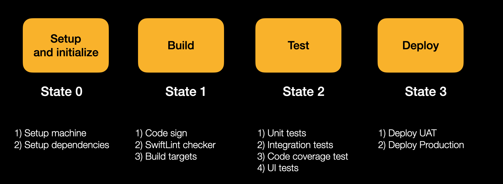

# 🍄 iOS

## Architecture

### Application main architecture (Clean Swift)

The Clean Swift architecture is derived from the Clean Architecture proposed by Uncle Bob. They share many common concepts such as the components, boundaries, and models.

### The VIP Cycle

The view controller, interactor, and presenter are the three main components of Clean Swift. They act as input and output to one another as shown in the following diagram.

The view controller’s output connects to the interactor’s input. The interactor’s output connects to the presenter’s input. The presenter’s output connects to the view controller’s input. We’ll create special objects to pass data through the boundaries between the components. This allows us to decouple the underlying data models from the components. These special objects consists of only primitive types such as Int, Double, and String. We can create structs, classes, or enums to represent the data but there should only be primitive types inside these containing entities.

This is important because when the business rules change that result in changes in the underlying data models. We don’t need to update all over the codebase. The components act as plugins in Clean Swift. That means we can swap in different components provided they conform to the input and output protocols. The app still works as intended.

A typical scenario goes like. The user taps a button in the app’s user interface. The tap gesture comes in through the IBActions in the view controller. The view controller constructs a request object and sends it to the interactor. The interactor takes the request object and performs some work. It then puts the results in a response object and sends it to the presenter. The presenter takes the response object and formats the results. It then puts the formatted result in a view model object and sends it back to the view controller. Finally, the view controller displays the results to the user.

#### Interactor

The interactor contains your app’s business logic. The user taps and swipes in your UI in order to interact with your app. The view controller collects the user inputs from the UI and passes it to the interactor. It then retrieves some models and asks some workers to do the work.

#### Worker

A profile view may need to fetch the user from Core Data, download the profile photo, allows users to like and follow, …etc. You don’t want to swamp the interactor with doing all these tasks. Instead, you can break it down into many workers, each doing one thing. You can then reuse the same workers elsewhere.

#### Presenter

After the interactor produces some results, it passes the response to the presenter. The presenter then marshal the response into view models suitable for display. It then passes the view models back to the view controller for display to the user.

#### Router

When the user taps the next button to navigate to the next scene in the storyboard, a segue is trigged and a new view controller is presented. A router extracts this navigation logic out of the view controller. It is also the best place to pass any data to the next scene. As a result, the view controller is left with just the task of controlling views.

#### Scene Model

In order to completely decouple the Clean Swift components, we need to define data models to pass through the boundaries between them, instead of just using raw data models. There are 3 primary types of models:

Request – The view controller constructs a request model and passes it to the interactor. A request model contains mostly user inputs, such as text entered in text fields and values chosen in pickers. Response – After the interactor finishes doing work for a request, it encapsulates the results in a response model and then passes it to the presenter.

View Model – After the presenter receives the response from the interactor, it formats the results into primitive data types such as String and Int, and stuff them in the view model. It then passes the view model back to the view controller for display.

### Card component architecture (MVVM)

## CI / CD

### Github Actions for **CI**

> GitHub Actions is a **continuous integration and continuous delivery** (CI/CD) platform that allows you to automate your build, test, and deployment pipeline. You can create workflows that build and test every pull request to your repository, or deploy merged pull requests to production.

### Fastlane Action for **CD**

> Automate your development and release process fastlane is an open source platform aimed at simplifying Android and iOS deployment. fastlane lets you automate every aspect of your development and release workflow.

### Build Pipeline

### Pipeline State

### Pipeline 1: On push request (PR)

### Pipeline 2: On push request (Merged)

### Release & Tags

* Changed Log / Features Note
* Tags (Versioning symmetric https://semver.org)

## Dependency management

* Cartage
* Cocoapods
* Swift Package Manager

## Tests monitor: codecov

* UI tests
* Code coverage (Xcode)

## Crash monitoring: Firebase Crashlytics

> Never miss a critical app crash with realtime alerts for new issues. Crashes are prioritized by impact on actual users so you know how to best fix bugs. Build Fast For Any Device. Customize Your App. Boost App Engagement. Accelerate Development. 

## Analytics: Mixpanel

> Mixpanel is a business analytics service company. It tracks user interactions with web and mobile applications and provides tools for targeted communication with them. Data collected is used to build custom reports and measure user engagement and retention.

## App performance monitoring

> Firebase Performance Monitoring, a real time app performance monitoring tool, helps you keep a close eye on your app as you roll out new features or make configuration changes. Performance Monitoring also gives you control over your performance data with a customizable dashboard that makes it easy to focus on your most important metrics.

**Keep your app fast and responsive**

> Gain insight into how your app performs from your users' point of view with a breakdown of trace and network data into dimensions like app version, country, device, and network type.

**Capture health and performance of network requests**

> Stay on top of your app's dependencies, network latencies, and errors affecting your users with automated monitoring of HTTP/S requests. You can also customize URL patterns to closely monitor response times, success rates, and payload sizes of your critical requests.

**Reduce troubleshooting and resolution time**

Understand the context in which performance issues take place and more easily address them using custom traces. You can also make use of automated traces, such as app startup time.

## Security

> The Secure Enclave is a dedicated secure subsystem integrated into Apple systems on chip (SoCs). The Secure Enclave is isolated from the main processor to provide an extra layer of security and is designed to keep sensitive user data secure even when the Application Processor kernel becomes compromised. It follows the same design principles as the SoC does—a boot ROM to establish a hardware root of trust, an AES engine for efficient and secure cryptographic operations, and protected memory. Although the Secure Enclave doesn’t include storage, it has a mechanism to store information securely on attached storage separate from the NAND flash storage that’s used by the Application Processor and operating system.

## Xcode Template

> XCode Templates is a tool for creating code snippets to give you a better starting point to achieve your goal. In this tutorial I will walk you through preparing a custom template for MVVM project architecture.

 

### Clean Architecture Template

#### Scene

* NameViewController.swift
* NamePresenter.swift
* NameInteractor.swift
* NameRouter.swift
* NameFacade.swift
* NameSceneModel.swift
* NameSceneWorker.swift
* Name.storybroad

#### View Component

* NameView.swift
* NameViewModel.swift

## Design Language

* Colors
* Typography
  * Font
  * Weight
  * Style
* UI Components
  * UI Element
* Line
* Spacer
* Theme
* Lanuage
* Asset
  * Filename
    * Snake case

## Etc.

* Post Man (API Live Document)
* Project Branch
  * main
  * develop
* Enviroment
  * Develop
  * Production
